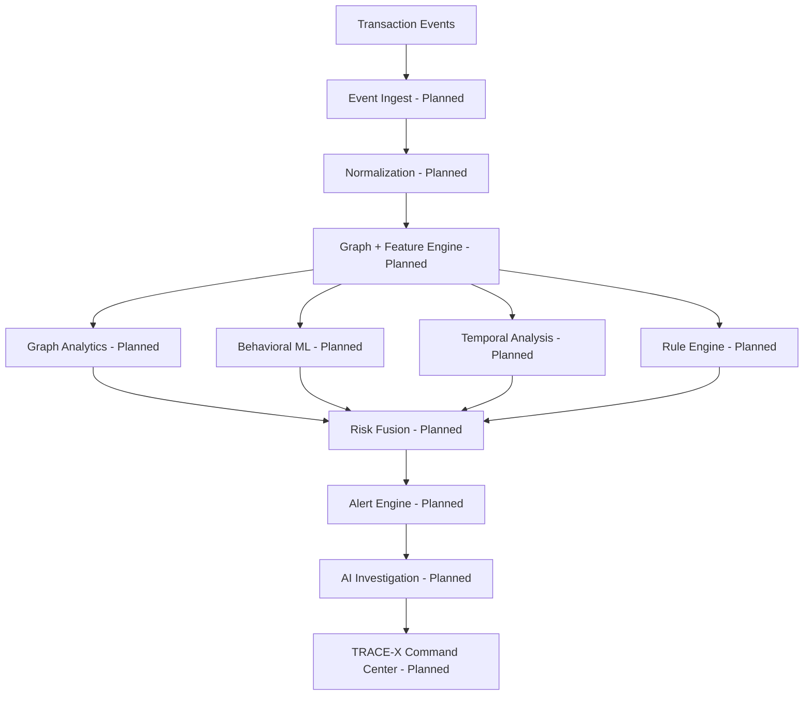

# TRACE-X
### Real-Time Financial Crime Graph Intelligence

> The problem isn't the transaction. It's the network.

[](https://www.python.org/)

TRACE-X is an AI-assisted financial crime intelligence platform that reconstructs transaction relationships as a dynamic graph and identifies potentially suspicious financial networks using graph analytics, behavioral anomaly detection, temporal analysis, rule-based detection, and evidence-grounded generative AI.

---

## 1. Problem

Conventional transaction compliance models evaluate events in isolation. Typically, rule-based alerts trigger when flat, predefined threshold metrics are met (such as transfers exceeding a specific cash value). This focus on transaction-level indicators creates a significant blindspot: organized money-laundering cartels bypass simple rules by distributing large illicit sums across multiple accounts, legal entities, proxy directors, and dynamic hardware signatures.

Consider the following transaction chain:
```
Company A ──► Account B ──► Company C ──► Account D ──► Wallet E
```
Individually, each transfer from account to account might remain well below compliance thresholds, appear fully ordinary, and trigger no alerts. However, when analyzed as a single connected system, the relationship-level topology reveals an anomaly. Relationship-level analysis is critical to bridging the gap between transaction rules and collaborative compliance networks.

---

## 2. Our Reframe

## The Problem Isn't the Transaction. It's the Network.

TRACE-X shifts analysis from isolated transaction logs to connected financial ecosystems. By evaluating connections alongside events, the system provides relationship-level network intelligence:

```
Entities + Transactions + Relationships + Time = Network Intelligence
```

---

## 3. Solution

TRACE-X models corporate metadata and transaction registries into a dynamic, live relationship graph. 

### Financial Graph Entities
* **Companies** (GSTIN, PAN, registration records)
* **Bank accounts** (IBAN, branch routing numbers)
* **Individuals & Directors** (PAN, identification keys)
* **Addresses** (Shared corporate offices or residential addresses)
* **Devices** (IP addresses, hardware UUIDs, browser fingerprints)
* **Wallets** (Cryptocurrency or digital wallets)
* **Merchants** (Point-of-sale terminals and merchant accounts)
* **Transactions** (Individual transfers, deposits, or withdrawals)

### Entity Relationships
* `OWNS` / `DIRECTOR_OF` (Corporate governance links)
* `TRANSFERRED_TO` (Transactional edges)
* `USES` / `REGISTERED_AT` (Identity, address, and device links)
* `CONTROLS` / `SHARED_ATTRIBUTE` (Implicit relationship markers)

### Detection Pipeline
Instead of relying on a single AI classifier, TRACE-X feeds these inputs through a multi-signal detection pipeline:

```
Transaction Events
       ↓
Event Ingestion
       ↓
 Normalization
       ↓
Graph + Feature Engine
       ↓
ML + Rule + Temporal Analysis
       ↓
  Risk Fusion
       ↓
  Alert Engine
       ↓
AI Investigation
       ↓
TRACE-X Command Center UI
```

---

## 4. Why TRACE-X Is Different

### 1. Network-Level Intelligence
Analyzes the entire topology of connected financial entities instead of reviewing transactions in isolation.

### 2. Temporal Intelligence
Monitors timing anomalies, tracking how quickly funds flow from node to node to capture pass-through laundering behavior.

### 3. Multi-Signal Risk Fusion
Blends rule matching, behavioral anomaly scores, network structure indices, temporal velocities, and entity-specific metrics into a single priority rating.

### 4. Explainable Investigation
Alerts expose the exact contributing signals (temporal bursts, shared hardware, etc.) rather than offering a black-box percentage.

### 5. Human-in-the-Loop AI
The LLM does not decide guilt. It acts as an investigator assistant, summarizing structured graph evidence in plain English.

---

## 5. Key Features

### Core Detection
* Transaction anomaly detection `[Planned]`
* Suspicious network detection `[Planned]`
* Circular transaction detection `[Planned]`
* Rapid pass-through detection `[Planned]`
* Funnel-account detection `[Planned]`
* Dormant-account reactivation detection `[Planned]`
* Shared metadata relationship detection `[Planned]`
* Transaction velocity analysis `[Planned]`

### Graph Intelligence
* Dynamic financial graph mapping `[Planned]`
* Entity relationship visualization `[Planned]`
* Network relationship traversal `[Planned]`
* Suspicious cluster identification `[Planned]`
* Connected entity dependency analysis `[Planned]`

### Investigation
* Live Network Zoom `[Planned]`
* Chronological Crime Replay `[Planned]`
* What-If Sandbox `[Planned]`
* Explainable Risk Scoring `[Planned]`
* Evidence visualization dashboard `[Planned]`
* Case brief generation `[Planned]`

### Generative AI
* Natural-language investigation assistant chat `[Planned]`
* Evidence-grounded case summaries `[Planned]`
* Structured case brief explanations `[Planned]`

---

## 6. System Architecture



### Component Architecture & Planned Tech Stack:
* **Event Ingestion:** Redpanda / Apache Kafka `[Planned]` (High-throughput queue buffer)
* **Caching & Buffer:** Redis `[Planned]` (Low-latency messaging queue)
* **API Gateway:** FastAPI `[Planned]` (Asynchronous routing and pipeline processing)
* **Graph Databases:** Neo4j `[Planned]` (Cypher-driven deep path lookup)
* **Behavioral Machine Learning:** XGBoost + Isolation Forest `[Planned]` (Anomaly classifiers)
* **GenAI Engine:** Gemini API `[Planned]` (Evidence summaries)
* **Frontend Dashboard:** Next.js + Vis.js `[Planned]` (Interactive node-link relationship console)

---

## 7. Detection Intelligence

### Rule Engine `[Planned]`
Checks transaction streams for deterministic compliance patterns:
* **Circular loops:** Direct or indirect fund cycles back to originators.
* **Rapid pass-throughs:** Inputs matched by immediate equivalent outputs.
* **Funnel structures:** Multiple source nodes routing into one bridge account.
* **Dormant reactivation:** High-velocity transactions on historically inactive profiles.

### Behavioral Machine Learning `[Planned]`
* **XGBoost:** Trains on tabular feature profiles to identify network classification indicators.
* **Isolation Forest:** Isolates transactional outliers without pre-labeled anomaly datasets.

### Graph Intelligence `[Planned]`
* Executes sub-second Cypher queries in Neo4j to identify shared-attribute networks (IP, address, metadata) and calculate network degree centrality.

### Temporal Pattern Engine `[Planned]`
* Extracts temporal features such as sequence-based intervals and clustering metrics to isolate velocity spikes.

---

## 8. Risk Scoring

TRACE-X merges multiple independent pipeline signals to prioritize alert queues:

```
Risk Score = Graph Signal + Behavioral Signal + Temporal Signal + Rule Signal + Entity Signal
```

Weight allocations are currently conceptual and under design. The final priority score is intended strictly to rank alert urgencies for compliance officers rather than automatically determine the legality of an account's transactions.

---

## 9. AI Investigation Assistant

To ensure explainability and prevent hallucinations, TRACE-X isolates the LLM from direct decision-making. 

```
Detection Engine (Neo4j/ML) ──► Structured Evidence Extract ──► LLM Context Generator ──► Plain-English Brief
```

### Context Evidence Inputs:
* Graph topology metrics (loops, hubs, shared device linkages)
* Temporal transaction velocities
* Flagged rule profiles
* Risk scores

The LLM (Gemini API) consumes only the structured data produced by the detection pipeline. It generates plain-English audit summaries and evidence descriptions.

> **Safety Design Principle:** The LLM does not independently determine whether a transaction is fraudulent. It explains evidence generated by the detection pipeline.

---

## 10. End-to-End Workflow

1. A transaction event enters the ingestion queue.
2. The event data is normalized.
3. Entity relationships are resolved against historical schemas.
4. The Neo4j graph is updated in real-time.
5. Behavioral features are calculated.
6. Temporal pattern engine checks event velocity.
7. Compliance rules are evaluated.
8. Core signals are fused into a risk score.
9. Networks scoring above risk thresholds generate system alerts.
10. A compliance analyst opens the alert in the command center.
11. **Crime Replay** walks through the transaction sequence chronologically.
12. **What-If Sandbox** simulates network changes by removing target nodes.
13. The **AI Investigation Assistant** translates the network metrics into plain-English summaries.

---

## 11. Technology Stack

| Layer | Technology | Purpose | Implementation Status |
|---|---|---|---|
| Presentation | Next.js / TypeScript | Interactive Command Center UI | 🔵 Planned |
| Visualization | Vis.js | Node-link financial graph layouts | 🔵 Planned |
| API Backend | FastAPI (Python) | Routing and pipeline logic | 🔵 Planned |
| Graph Database | Neo4j / Cypher | Entity relationship queries | 🔵 Planned |
| Event Streaming | Redpanda / Kafka | Ingestion queue buffering | 🔵 Planned |
| State Buffer | Redis | Low-latency queue cache | 🔵 Planned |
| Anomaly ML | XGBoost | Behavioral feature modeling | 🔵 Planned |
| Outlier Detection | Isolation Forest | Unsupervised anomaly isolation | 🔵 Planned |
| Generative AI | Gemini API | Grounded case brief compilation | 🔵 Planned |

---

## 12. Project Structure

```
.
├── Omnikon.pdf                  # Hackathon problem statement handbook
├── README.md                    # Project documentation
└── phase1_proposal_tracex.pdf   # Phase 1 presentation deck
```

*Planned directory structure for Phase 2 development:*
```
├── frontend/                    # Next.js visual console dashboard
├── backend/                     # FastAPI endpoint service pipeline
├── ml/                          # Anomaly profiling training models
└── graph/                       # Neo4j Cypher scripts and loader utilities
```

---

## 13. Data Strategy

Since live corporate bank registries and financial log files are restricted under data privacy laws, TRACE-X will run on **simulated, synthetic data**. The transaction generator script will model normal transactions alongside specific laundering scenarios:
* Normal transaction behavior patterns.
* Circular layering cycles.
* Many-to-one mule funnel paths.
* Rapid pass-through transaction chains.
* Dormant-account reactivation spikes.
* Shared corporate addresses and registration data clusters.

---

## 14. Example Suspicious Patterns

### Circular Layering
Funds travel through intermediary nodes and return to the sender:
```
A ──► B ──► C ──► D ──► A
```

### Funnel Structure
Multiple source accounts transfer money to a bridge account that routes to an exit node:
```
A ─┐
B ─┤
C ─┼──► X ──► Exit Wallet
D ─┤
E ─┘
```

### Rapid Pass-Through
Money enters a node and is immediately transferred to a secondary node to disrupt trace lines:
```
Source ──► Account A ──► Account B ──► Exit Wallet
```

*Note: These visual structures are prototype detection parameters and do not constitute legal proof of illegal activity by themselves.*

---

## 15. Validation Strategy

Validation benchmarks will evaluate system performance against synthetic dataset parameters. The primary indicators monitored include:
* **Precision:** Ratio of correctly identified networks to total triggered alerts.
* **Recall:** Ratio of correctly flagged anomalies to actual injected patterns.
* **F1-score:** Balanced detection quality indicator.
* **False Positive Rate (FPR):** Monitoring false alert rates.
* **Detection Latency:** Time taken from event ingestion to alert trigger.
* **Graph Query Latency:** Cypher path query performance timings in Neo4j.

> *Benchmark results will be reported after prototype validation.*

---

## 16. Current Implementation Status

| Module Component | Status |
|---|---|
| Phase 1 PDF Proposal | ✅ Implemented |
| Next.js Frontend Console | 🔵 Planned |
| Transaction Generator Service | 🔵 Planned |
| Graph Database Schemes | 🔵 Planned |
| API Pipeline Routing | 🔵 Planned |
| XGBoost & ML Models | 🔵 Planned |
| Temporal Analysis Logic | 🔵 Planned |
| Risk Score Fusion | 🔵 Planned |
| Crime Replay Module | 🔵 Planned |
| What-If Sandbox Mode | 🔵 Planned |
| AI Summarization Engine | 🔵 Planned |

---

## 17. Demo Flow

1. Start the synthetic transaction stream.
2. Normal transactions flow through the interface.
3. Inject a circular laundering path into the stream.
4. TRACE-X flags the transaction circle.
5. The alert appears in the priority queue.
6. The analyst clicks the alert, and the graph zooms into the node cluster.
7. The analyst activates **Crime Replay** to watch the funds flow chronologically.
8. The analyst uses the **What-If Sandbox** to test node dependencies.
9. The **AI Assistant** drafts a case report based on the detection engine data.
10. The analyst exports the generated evidence file.

---

## 18. Installation & Setup `[Planned]`

Prerequisites: Node.js (v18+), Python (v3.10+), Neo4j Community Server, Redis, and Kafka.

### 1. Database Setup
Start your local Neo4j server, access the browser console, and set your environment credentials.

### 2. Backend Setup
```bash
# Clone the repository
cd backend
python -m venv venv
source venv/bin/activate  # On Windows: .\venv\Scripts\activate
pip install -r requirements.txt
```

### 3. Frontend Setup
```bash
cd ../frontend
npm install
```

---

## 19. Environment Variables `[Planned]`

Create a `.env` file in your root folder. 

```env
GEMINI_API_KEY=your_gemini_api_key_here
NEO4J_URI=bolt://localhost:7687
NEO4J_USERNAME=neo4j
NEO4J_PASSWORD=your_secure_password
REDIS_HOST=localhost
REDIS_PORT=6379
KAFKA_BOOTSTRAP_SERVERS=localhost:9092
```

---

## 20. Running the Project `[Planned]`

### Running the Backend Service:
```bash
cd backend
uvicorn main:app --reload
```

### Running the Next.js Frontend Console:
```bash
cd ../frontend
npm run dev
```

### Running the Transaction Generator Stream:
```bash
cd ../backend
python scripts/generate_stream.py
```

---

## 21. API / Service Overview `[Planned]`

### Route: Post Transaction Event
* **Method:** `POST`
* **Endpoint:** `/api/v1/transactions/ingest`
* **Purpose:** Queue incoming transaction logs for preprocessing.
* **Payload:** Transaction metadata object.

### Route: Get Risk Alerts
* **Method:** `GET`
* **Endpoint:** `/api/v1/alerts`
* **Purpose:** Retrieve lists of flagged networks sorted by priority.

### Route: Get Case Briefs
* **Method:** `POST`
* **Endpoint:** `/api/v1/investigate`
* **Purpose:** Request evidence-grounded summarization from the Gemini API model.

---

## 22. Future Roadmap `[Planned / Future Scope]`

* **Graph Neural Networks (GNNs):** Real-time node embeddings via GraphSAGE to detect unknown anomalies.
* **Advanced Temporal Learning:** Integration of temporal graph networks to track continuous-time state changes.
* **Watchlist Integration:** Automatic checking against PEP and global financial sanctions databases.
* **Human-in-the-Loop Feedback:** Training classifiers dynamically on investigator case resolutions.
* **Cloud-Scale Ingestion:** Distributed stream pipelines using Apache Flink.

---

## 23. Limitations & Responsible Use

* **Synthetic Data:** The prototype runs on simulated scenarios, which may not capture the full complexity of production banking networks.
* **Prioritization Tool:** Risk scores are built for prioritization and audit logging. They represent suspicious patterns, not definitive proof of crime.
* **Review Required:** All generative AI summaries must be verified by a compliance analyst before report filing.

---

## 24. Team

### BrainBytes
* **Hitha D S**
* **Chandan D K**

---

## 25. Hackathon

* **Competition:** Omnikon National Hackathon 2026
* **Problem Statement:** Omni_FinTech_10 — Detecting Shell Companies and Suspicious Transactions
* **Theme:** FinTech & Financial Inclusion

---

## 26. License

License: To be determined.
